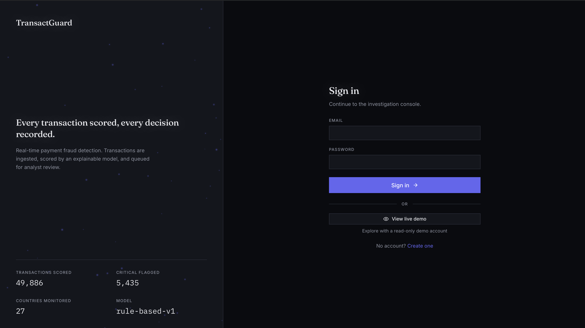
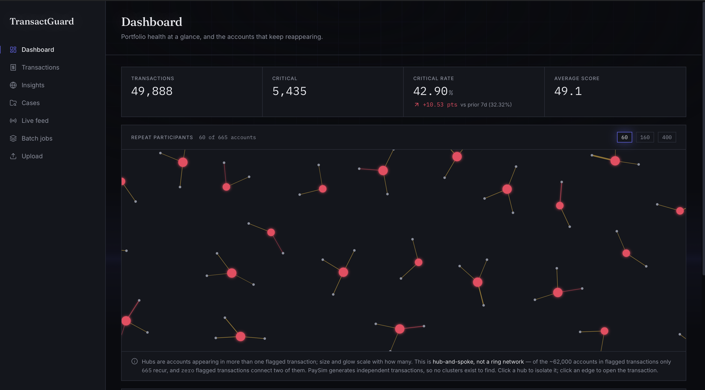
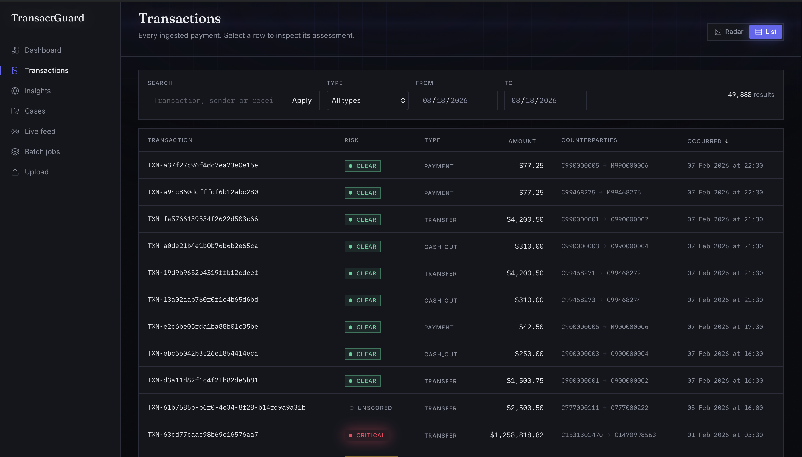
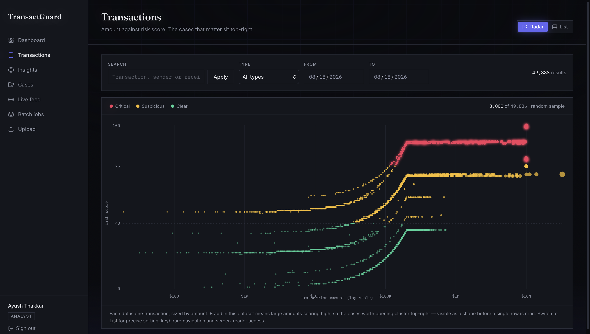
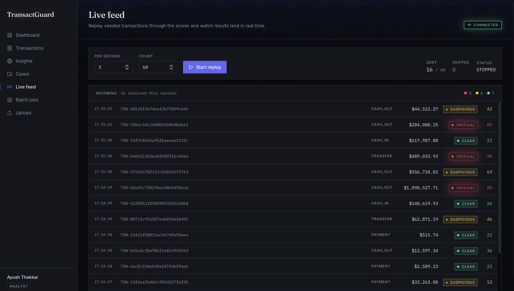

# TransactGuard

**Real-time payment fraud detection — every transaction scored, every decision recorded.**

[](#)
[](LICENSE)
[](https://nodejs.org)
[](https://react.dev)
[](https://fastapi.tiangolo.com)
[](https://postgresql.org)
[](https://redis.io)
[](https://docker.com)

A fraud analyst's console: ingest payment transactions, score them with an explainable model, and work the results as a review queue — with live scoring streamed to the browser and every decision written to an audit trail.

---

## Live demo

**→ [transactguard.vercel.app](https://transactguard.vercel.app)** *(replace with your URL after deploying)*

**No signup required.** Click **View live demo** on the login page — it signs you into a read-only account so you can explore the dashboard, the geo map, the transaction radar and the detail drawer without creating anything.

> The demo runs on free hosting that sleeps when idle. The first request can take up to a minute to wake the server; the app shows a "waking up" notice rather than leaving you guessing.

---

## Why this exists

Card and transfer fraud is caught by models, but it is *resolved* by people. The gap that costs money is rarely detection alone — it is the analyst who receives a flagged transaction with no explanation, cannot tell a genuine fraud from a false positive, and either blocks a good customer or waves through a real loss. Every false positive is a customer whose legitimate payment was declined; every missed case is a direct write-off.

TransactGuard is built around that gap. A score on its own is not actionable, so every prediction carries a ranked breakdown of *why* — the specific factors that fired, weighted by how much each moved the number — and every analyst decision is recorded against the transaction it belongs to. The interface is designed for someone who has to justify a decision afterwards.

---

## Architecture

```
                    ┌──────────────────────────────────────┐
  Browser ─────────▶│  React 18 + Vite      (Vercel)       │
   REST + WebSocket └──────────────┬───────────────────────┘
                                   │
                    ┌──────────────▼───────────────────────┐
                    │  Node / Express gateway  (Render)    │
                    │  auth · RBAC · validation · audit    │
                    └──┬────────┬────────┬──────────┬──────┘
                       │        │        │          │
              ┌────────▼──┐ ┌───▼────┐ ┌─▼───────┐ ┌▼─────────────────┐
              │ Postgres  │ │ Redis  │ │ FastAPI │ │ BullMQ worker    │
              │ (Supabase)│ │(Upstash)│ │ scorer  │ │ separate process │
              └───────────┘ └────────┘ └─────────┘ └──────────────────┘
```

**Why a separate ML service.** Scoring is Python's job — the model, once real, is an XGBoost artefact with a SHAP explainer, and neither has a good Node equivalent. Keeping it behind an HTTP boundary means the model can be retrained, versioned and redeployed without touching the API, and the API can fall back cleanly when it is unavailable. The two authenticate with a shared internal key; the browser never talks to the scorer directly.

**Why Redis, specifically.** It does three separate jobs here, and it is worth naming them because they have nothing to do with each other:
1. **Token denylist** — logout must actually end a session, so revoked JWT ids live in Redis with a TTL matching the token's own expiry, which means the denylist cleans itself.
2. **Rate limiting** — login throttling counts in Redis rather than process memory, so the limit still holds when the API runs as more than one instance.
3. **Queue + pub/sub backend** — BullMQ's job state, and the channel the worker publishes progress on.

**Why BullMQ.** Scoring 20,000 transactions cannot happen inside an HTTP request. Work is split into chunks of 100, queued, and processed five at a time with three retries and exponential backoff. Chunk counters move with atomic SQL increments, so five workers finishing simultaneously cannot lose each other's writes, and the job reaches a terminal status even when every retry is exhausted.

**Why Socket.IO.** The worker runs as a *separate OS process* from the server holding the browser connections — it has no socket to emit on. So it publishes progress to Redis, and the API process subscribes and re-broadcasts to the room watching that job. Clients join a room per job rather than receiving a global broadcast, so a 60-chunk run does not spray sixty messages at every connected browser.

That indirection is what makes the deployment flexible. Render's free plan has no Background Worker type, so the hosted build sets `RUN_WORKER_INLINE=true` and runs the consumer inside the API process at concurrency 2. Because progress already travels over Redis rather than a shared object, neither the worker nor the frontend needed a single change to move — and moving back out on a paid plan is one environment variable.

**Why XGBoost (next).** The scorer today is a deterministic rule engine — five weighted factors, fully explainable, and a stand-in with the same request and response contract the real model will use. Swapping it means changing one file. See [Model performance](#model-performance) for why the rules are not good enough on their own.

---

## Features

### Login — split-screen with live figures
Live counters pulled from the API, a drifting particle field that leans toward the cursor, and one-click read-only demo access.



### Dashboard — KPIs, repeat participants, risk trend
Counters animate up on load; the fraud rate is compared against the previous window in percentage points with direction encoded as both arrow and colour.



### Transaction detail — the signature surface
A hand-built SVG gauge (240° arc, graduated every 10 points, needle springs past its value and settles while the score counts up), a plain-English assessment, and the **evidence ledger**: every factor that fired, ranked by how much it moved the score.



### Risk radar — the shape of the data
Amount against risk score on a canvas scatter, log-scaled because amounts span $0 to $10M. Fraud here means large amounts scoring high, so the cases worth opening cluster top-right — visible before a single row is read.



### Live feed — scoring as it happens
A simulator replays seeded transactions through the scorer at a chosen rate; results arrive over Socket.IO with a glow flash in their risk colour.



### Also built
- **Cases** — kanban review queue, drag to change status, sorted by risk descending
- **Insights** — d3-geo world map plus a real hour-of-day risk signal
- **Batch jobs** — chunk-by-chunk progress bar filling live over WebSocket, with retry
- **Upload** — drag-drop CSV with a **column-mapping preview** before anything is committed
- **Users** — admin-only role management, with guard rails against privilege escalation

---

## Tech stack

| Category | Technology | Why |
| --- | --- | --- |
| Frontend | React 18 + Vite | Login-walled internal tool — no SSR or SEO requirement, so a SPA is the honest choice |
| Styling | Tailwind CSS v4 | CSS-variable-native `@theme`, so design tokens are defined once and used everywhere |
| Data fetching | TanStack Query | Caching, background refetch and request dedupe without hand-rolled state |
| Client state | Zustand | Auth and UI state; small enough that Redux would be ceremony |
| Charts | Recharts + hand-built canvas/SVG | Recharts for the trend area; the gauge, radar, geo map and force graph are custom because the glow and motion are the point |
| Motion | Framer Motion | Spring physics for the drawer and gauge — a needle that overshoots reads as an instrument |
| API | Node 20 + Express 5 | Native async error propagation; the ecosystem the ORM and queue live in |
| ORM | Prisma 7 | Type-safe queries and migrations-as-history; driver adapter for Postgres |
| Database | PostgreSQL 16 | Relational integrity for money, `Decimal(18,2)` for amounts — never a float |
| Cache / queue | Redis 7 | Token denylist, rate limiting, BullMQ backend, pub/sub bridge |
| Queue | BullMQ | Chunked batch scoring with retries and backoff, in a separate worker process |
| Realtime | Socket.IO | Room-scoped job progress and live feed, with polling fallback behind proxies |
| ML service | FastAPI + Pydantic v2 | Python is where the model lives; Pydantic validates the contract at the boundary |
| Validation | Zod 4 | One schema layer for env vars, request bodies and query params |
| Auth | JWT + bcrypt | 15-minute access token, 7-day refresh, RBAC across three roles |
| Infra | Docker Compose | Postgres and Redis reproducible locally in one command |

---

## Getting started locally

**Prerequisites:** Docker Desktop, Node 20+, Python 3.11+

```bash
git clone https://github.com/<your-username>/transactguard.git
cd transactguard

# 1 — dependencies
cd backend && npm install && cd ..
cd frontend && npm install && cd ..
cd ml_service && python3 -m venv .venv && .venv/bin/pip install -r requirements.txt && cd ..

# 2 — configuration
cp backend/.env.example backend/.env
cp ml_service/.env.example ml_service/.env

# generate secrets (the two JWT values MUST differ — the app refuses to start otherwise)
node -e "console.log('JWT_SECRET='+require('crypto').randomBytes(48).toString('hex'))"
node -e "console.log('JWT_REFRESH_SECRET='+require('crypto').randomBytes(48).toString('hex'))"
python3 -c "import secrets; print('INTERNAL_API_KEY='+secrets.token_hex(32))"

# choose your own seed passwords — none are committed
echo "ADMIN_SEED_PASSWORD=\"$(openssl rand -base64 18)\""   >> backend/.env
echo "ANALYST_SEED_PASSWORD=\"$(openssl rand -base64 18)\"" >> backend/.env
```

`ML_SERVICE_API_KEY` in `backend/.env` must equal `INTERNAL_API_KEY` in `ml_service/.env` — that one shared secret is how the two services authenticate.

```bash
# 3 — database
docker compose up -d
cd backend
npx prisma migrate dev
npx prisma db seed

# 4 — transactions (optional but recommended)
# Download PaySim from Kaggle → backend/prisma/data/
#   https://www.kaggle.com/datasets/ealaxi/paysim1
node prisma/seedTransactions.js     # ~50k rows, ~35s
node prisma/seedGeography.js        # synthetic country dimension for the map
cd ..

# 5 — run everything
./dev.sh
```

`./dev.sh` starts Postgres, Redis, the ML service, the API, the worker and the frontend in dependency order with real readiness checks. `./dev.sh stop` stops them; `./dev.sh status` reports what is up.

Open **http://localhost:5173**.

---

## Model performance

The scorer today is a **deterministic rule engine** — five weighted factors summing to a 0–100 score:

| Factor | Weight | Fires when |
| --- | --- | --- |
| Amount anomaly | 35% | Amount relative to a $200,000 reference, scaled below it |
| Balance drain | 25% | Sender emptied to exactly zero, or the balance does not reconcile |
| Destination anomaly | 20% | Receiver had a zero balance — maxed if still zero afterwards |
| Transaction type risk | 10% | `TRANSFER` 1.00, `CASH_OUT` 0.90, down to `CASH_IN` 0.10 |
| Round-number bias | 10% | Exact multiple of $10,000 down to $100 |

Validated against PaySim's 8,213 ground-truth fraud labels (300 fraud + 300 legitimate, sampled at random):

| | Mean score | Clear | Suspicious | Critical |
| --- | --- | --- | --- | --- |
| **Fraud** | 75.7 | 7 | 146 | 147 |
| **Legitimate** | 43.0 | 127 | 164 | 9 |

**Recall 0.977 · Precision 0.629 · F1 0.765** on that balanced sample.

**The honest caveat, and the reason XGBoost is next.** Precision measured on a 50/50 sample is not precision in production. At PaySim's true fraud rate of 0.129%, a 57% false-positive rate drowns the true positives and precision collapses to roughly **0.2%**. The rules find fraud — 97.7% of it — but cannot avoid flagging everything else alongside it. That gap is not a tuning problem; it is what a hand-weighted linear score cannot do. A gradient-boosted model learning feature interactions from the labelled data is the fix, and the service contract is already shaped for it: same request, same response, same explanation structure, one file to swap.

---

## What I'd do with more time

Things I know are missing, in the order I would fix them:

- **Refresh-token rotation.** Refresh tokens currently live their full 7 days unrotated. Issuing a new one on every use and revoking the old one turns a stolen token into a detectable replay rather than a week of access.
- **httpOnly cookie auth.** The access token is held in memory and the refresh token in `sessionStorage` — a deliberate trade-off, documented in `frontend/src/lib/api.js`, but the correct answer is an httpOnly `SameSite=Strict` cookie issued by the API. That needs a same-site deployment or a CORS credentials setup this project does not have yet.
- **Real observability.** Structured logs exist; traces, metrics and alerting do not. A fraud platform that cannot tell you its own p99 scoring latency is not production-ready.
- **Automated test suite in CI.** Everything here was verified end to end against live services, but as shell and Node scripts rather than a committed Vitest/pytest suite running on every push.
- **Prediction embedding on the transactions list.** The table resolves risk with one cached lookup per visible row because `GET /transactions` does not embed its prediction. It works and it is bounded, but the right fix is an `include=prediction` option on the endpoint.
- **A real ML pipeline.** Training, versioning, drift monitoring and a model registry — today the "model" is a Python module with hard-coded weights.

---

## Project layout

```
transactguard/
├── backend/          Express API, Prisma schema, BullMQ worker
│   ├── prisma/       schema, migrations, seed scripts
│   └── src/
│       ├── config/   env, db, redis, queue, socket
│       ├── modules/  auth · transactions · predictions · jobs · cases · analytics · simulator
│       ├── realtime/ Redis pub/sub bridge
│       └── workers/  batch scoring consumer
├── ml_service/       FastAPI scorer
│   └── app/
│       ├── api/v1/   /predict/single, /predict/batch
│       └── models/   fraud_engine.py — the swap point for XGBoost
├── frontend/         React + Vite SPA
├── docker-compose.yml
├── render.yaml       Render blueprint: API (worker inline), ML service
├── dev.sh            one-command local startup
└── DEPLOYMENT.md     step-by-step free-tier deployment
```

---

## License

[MIT](LICENSE) — free to use, modify and distribute.

---

<sub>Built as a portfolio project. The transaction data is [PaySim](https://www.kaggle.com/datasets/ealaxi/paysim1), a synthetic mobile-money dataset; the country dimension is synthesised from account ids and labelled as such in the interface, because PaySim ships no geography.</sub>
